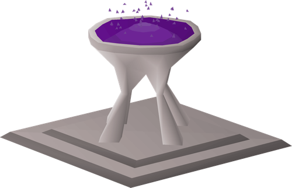

# Live Right Now

A RuneLite plugin that tracks selected Twitch and Kick streamers and alerts you in-game when they go live.

  

## Features

- **Twitch and Kick Support:** Monitor selected streamers on both platforms.
- **Notifications:** Send alerts to chat, your desktop, or both.
- **Persistent Alerts:** The plugin remembers broadcasts across RuneLite logins and restarts.
- **Simple Setup:** Connect your Twitch and Kick accounts with one click in your browser.

> **Notification behavior:** The plugin alerts once for each live broadcast, including a broadcast already in progress when you first add or configure a streamer. It remembers the broadcast across RuneLite logins and restarts, so the same live stream will not alert repeatedly. A new alert is sent when the streamer starts a new broadcast. If several new broadcasts are detected together, they are combined into one notification.

## Configuration

1. In the RuneLite sidebar, open the **Live Right Now** settings panel.
2. Click **Connect Twitch** and/or **Connect Kick** to authorize your accounts.
3. Add comma-separated usernames under **Tracked Streamers** in the **Twitch** and/or **Kick** sections (e.g. `b0aty, odablock, paymoneywubby`).
4. Customize your in-game chat or desktop notification preferences under **Notifications**.

## How authorization works

Clicking **Connect Twitch** opens Twitch directly using the implicit grant. Twitch returns the access token in the callback URL fragment; JavaScript served from `http://localhost:4646/callback` removes the fragment and posts the token and state to the local listener. Clicking **Connect Kick** opens Kick directly using PKCE; RuneLite sends Kick's authorization code and PKCE verifier to the [Live Right Now OAuth Proxy](https://github.com/tcurrent/live-right-now-oauth-proxy), which exchanges it using the Kick client secret and returns a short-lived handoff. The local listener binds to `localhost:4646` and validates each flow's state.

See [privacy documentation](docs/privacy.md), [security documentation](docs/security.md), and the [Plugin Hub review notes](docs/plugin-hub-review.md).
